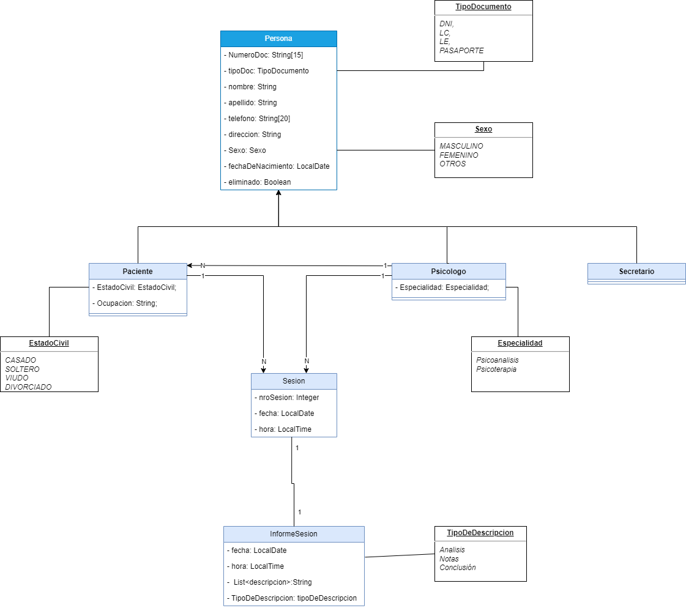

# Trabajo en Equipo

El líder del equipo en esta iteración será Pavon Gabriel. 
El trabajo que realizará cada integrante es el siguiente:

- Gelabert, André: Desarrollo del front-end y backend de la clase InformeSesion.
- Pavon, Gabriel: Desarrollo de wireframes y backend de la clase InformeSesion.
- Martinez, Facundo: Desarrollo de backend de la clase InformeSesion y testing.

# Diseño OO

### Diagrama de Clases

# Wireframe y Caso de Uso

### Vista de Registro de Secretario

**Caso de uso**: Registrar Secretario

**Descripción**: El usuario desea registrar un nuevo secretario al sistema.

**Precondición**:

**Postcondición**: El secretario debe quedar registrado.

**Flujo Tipico de Eventos**

Actor |                                                                                                                            Sistema                                                                                                                            |
:----------:|:-------------------------------------------------------------------------------------------------------------------------------------------------------------------------------------------------------------------------------------------------------------:|
   Este caso de Uso comienza cuando el usuario hace clic sobre el apartado “Secretarios”   |                                                                                                                                                                                    
   ----   |                El sistema muestra un formulario en la sección “Registrar Nuevo Secretario” con los siguientes campos: - Tipo - Número  - Nombre  - Apellido  -Fecha de Nac.  - Sexo   - Dirección  - Teléfono                 |
     El usuario selecciona el tipo de documento del secretario (Tipo)       |                                                                                                                                                                                                                                                               |
      El usuario ingresa el identificador del secretario (Número)      |                                                                                                                                                                                                                                                               |
            |        |                                                                                              El sistema verifica que el ID (DNI) del secretario cargado no exista.                                                                                              
        |   El usuario completa los campos con los datos del paciente.    |
    |           |                                                                                            El sistema verifica si todos los datos fueron ingresados correctamente.                                                                                            
     El usuario hace clic sobre el botón “Agregar Secretario”   |                                                                                                                                                                                                                                                               |
    |       |                                                                                                            El sistema registra un nuevo secretario.                                                                                                             

**Flujo Alternativo**:

- Paso 7: Si no se ingresa alguno o ninguno de los datos y/o se ingresaron incorrectamente, se informa al usuario y se retorna al paso 3.
- Paso 9: Si el secretario ya está registrado en el sistema, el sistema muestra el mensaje de error “Este secretario ya está registrado”y redirige al paso 3.

## Vista Registrar Informe de Sesion

**Caso de uso**: Registrar Informe Sesión

**Descripción**: El usuario desea registrar un nuevo informe de sesión al sistema y asociarlo a una sesión.

**Precondición**: La sesión, el paciente y el psicólogo deben estar previamente registrada

**Postcondición**: El informe de sesión debe quedar registrado y asociado a una sesión.

**Flujo Tipico de Eventos**

Actor |                                                                                                                               Sistema                                                                                                                                |
:----------:|:--------------------------------------------------------------------------------------------------------------------------------------------------------------------------------------------------------------------------------------------------------------------:|
   Este caso de uso comienza cuando el usuario hace clic sobre el apartado “Sesiones”  |
   ----   | El sistema redirige al usuario a una ventana con las sesiones registradas|
     El usuario hace clic sobre el siguiente botón: "+"     |                                                                                                                                                                                                                                                                      |
|
|        |                                                                                                 El sistema redirige al usuario a una ventana con la información de la sesión, los datos del paciente de dicha sesión, un input para introducir una descripción obligatoria (*Resumen) y un símbolo + para agregar nuevas descripciones                                                                                                
|   El Psicólogo redacta el informe escribiendo en el input de la descripción seleccionada    |
|    El psicólogo hace clic sobre el botón “registrar informe”       |                                                                                                                                                                                            
     El usuario ingresa la fecha en la que se realizará la sesión.   |                                                                                                                                                                                                                                                                      |
|       |                                                                                                              El sistema registra el informe

**Flujo Alternativo**:
- Paso 4: Si el usuario clickea en el símbolo + le permite agregar una nueva descripción no obligatoria con su respectivo input para escribir.
- Paso 10: Si el usuario no ingresa información en el inciso sobre la sesión, el sistema muestra el mensaje “error al registrar informe de sesión” y retorna al paso 8.

# Backlog de iteraciones 
### Sprint 2
1. HU-009: Registrar Secretario.
2. HU-010: Modificar Secretario.
3. HU-011: Eliminar Secretario.
4. HU-012: Listar Secretario.
5. HU-020: Registrar informe de sesión.
6. HU-021: Consultar informe de sesión.

# Tareas

### HU-009, HU-010, HU-011, HU-012.

- Las tareas de estas historias de usuario se finalizaron en la iteración 1.

### HU-020, HU-021
 - Crear la clase InformeDeSesion.
 - Crear una clase enum TipoDeDescripcion que sea atributo de la ClaseInformeDeSesion
 -  Crear la interfaz InformeDeSesionRepository.
 -  Crear la interfaz InformeDeSesionService con los metodos a ser implementados en la clase InformeDeSesionServiceImpl
 -  Dentro de la carpeta “impl” en services crear la clase InformeDeSesionServiceImpl.
 -  Crear un controlador InformeDeSesionController en el cual se inyectará la clase InformeDeSesionServiceImpl

# Retrospectiva