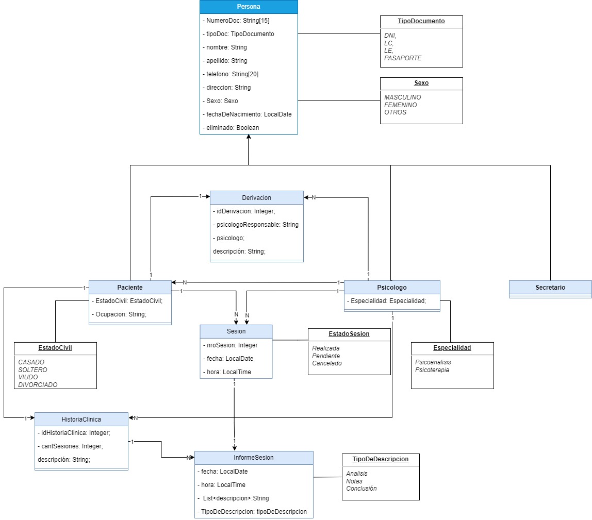
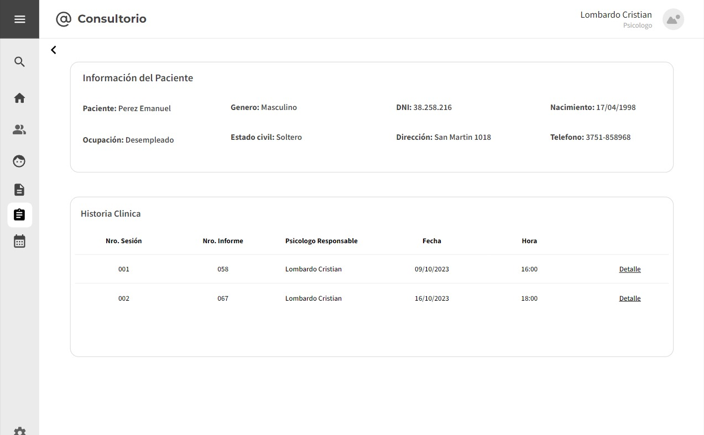
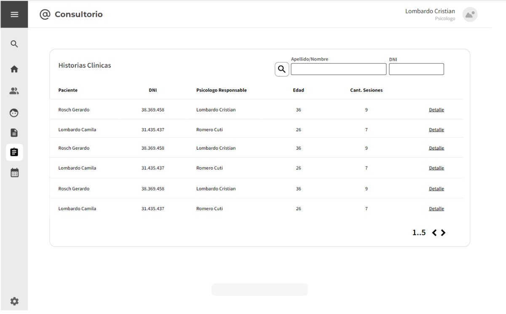

# Trabajo en Equipo

Trabajo en equipo: incluyan el nombre del líder del equipo para esta iteración y describan qué trabajo ha realizado cada integrante.

El líder del equipo en esta iteración será Pavon Gabriel. El trabajo que realizará cada integrante es el siguiente:

- Gelabert, André: Desarrollo del front-end y backend de la clase HistoriaClinica.
- Pavon, Gabriel: Desarrollo de wireframes y backend de la clase HistoriaClinica.
- Martinez, Facundo: Desarrollo de backend de la clase HistoriaClinica y testing.

# Diseño OO

### Diagrama de Clase

---

# Wireframe y Caso de Uso

### Listar Historia Clinica

**Caso de uso**: Listar Historia Clínica

**Descripción**: El usuario desea listar todas las historias clínicas de todos los pacientes.

**Precondición**: Debe existir un paciente asociado a una historia clínica.

**Postcondición**:

**Flujo Tipico de Eventos**

Actor |                                                                                                             Sistema                                                                                                             |
:----------:|:-------------------------------------------------------------------------------------------------------------------------------------------------------------------------------------------------------------------------------:|
   Este caso de Uso comienza cuando el usuario hace clic sobre el apartado “Historias Clínicas”   |
   ----   | El sistema muestra un listado de las historias clínicas de los pacientes correspondientes, la cantidad de sesiones y el psicólogo responsable.
**Flujo Alternativo**:
- Paso 2: si no hay un listado de historias clinicas el sistema muestra un mensaje informando al usuario que no hay historias clinicas disponibles.

---

### Consultar Historia Clínica
**Caso de uso**: Listar Historia Clínica

**Descripción**: El usuario desea listar todas las historias clínicas de todos los pacientes.

**Precondición**: Debe existir un paciente asociado a una historia clínica.

**Postcondición**:

**Flujo Tipico de Eventos**

Actor |                                                                                                             Sistema                                                                                                             |
:----------:|:-------------------------------------------------------------------------------------------------------------------------------------------------------------------------------------------------------------------------------:|
   Este caso de uso comienza cuando el usuario hace clic sobre el apartado “detalles” ubicado a la derecha de una historia clínica.   |
   ----   | El sistema redirige al usuario a una ventana con la lista de los informes de sesión y los datos del paciente asociado a la historia clínica seleccionada.
**Flujo Alternativo**:
- Paso 2: Si la historia clínica no tiene informes de sesión asociados, se muestra un mensaje “No se encuentra una historia clínica asociada a este paciente”.

---
# Backlog de iteraciones
### Sprint 2
1. HU-017: Generar Historia Clínica.
2. HU-018: Buscar Historia Clínica.
3. HU-019: Listar Historia Clínica.

---
# Tareas

### HU-020, HU-021.

- Las tareas de estas historias de usuario se finalizaron en la iteración 2.

### HU-020, HU-021
-Crear la clase HistoriaUsuario.
- Generar relaciones con las entidades Paciente e InformeSesion
- Crear el repositorio HistoriaUsuarioRepo
- Crear la interfaz HistoriaUsuarioService.
- Implementar la interfaz de HistoriaUsuarioService en la clase HistoriaUsuarioServiceImpl e inyectar el repositorio correspondiente.
- Crear el controlador correspondiente HistoriaUsuarioController.
- Crear las vistas correspondientes con el controlador.

---

