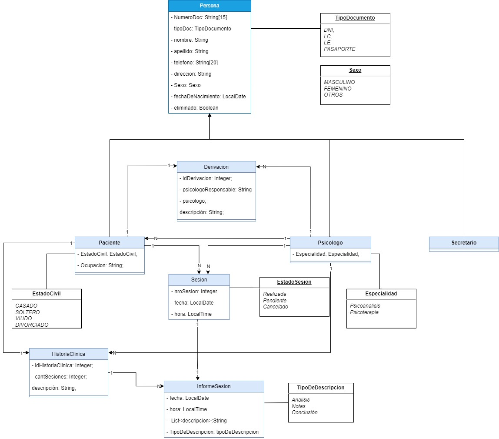
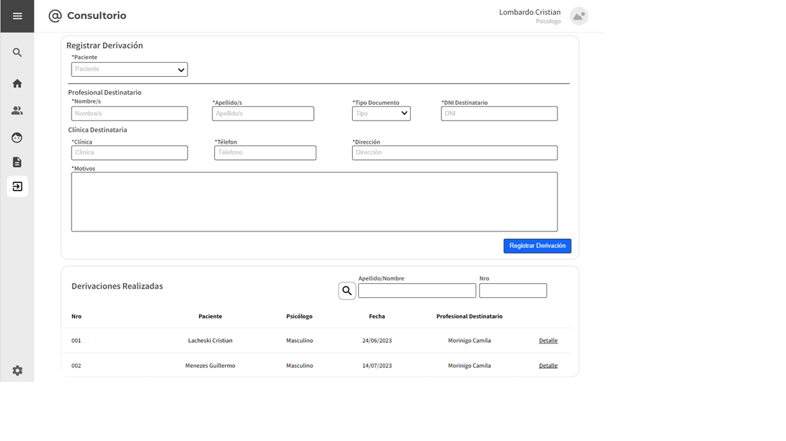

# Trabajo en equipo

El líder del equipo en esta iteración será Martinez, Facundo. 
El trabajo que realizará cada integrante es el siguiente:

- Gelabert, André: Desarrollo del front-end y backend de la clase Derivación.
- Pavon, Gabriel: Desarrollo de wireframes y backend de la clase Derivación.
- Martinez, Facundo: Desarrollo de backend de la clase Derivación y testing.

---
## Diseño OO

### Diagrma de clases

---
## Wireframe y Casos de Uso Real

Actor |                                                                                                                Sistema                                                                                                                 |
:----------:|:--------------------------------------------------------------------------------------------------------------------------------------------------------------------------------------------------------------------------------------:|
   Este caso de uso comienza cuando el usuario hace clic sobre el apartado “Derivaciones”  |
   ----   |                                                                                                        El sistema devuelve un un formulario mostrando en primera instancia el campo “Paciente”.  Se muestran los campos sobre información del Profesional Destinatario “Nombre/s” “Apellido/s” “Tipo Documento” “DNI Destinatario”. Un apartado “Clínica Destinataria” con los campos “Clínica” “Teléfono” y “Dirección”, se muestra un input de texto con la leyenda “Motivos”.                                                                                                         |
       El usuario selecciona el paciente en el campo “Paciente”. En la sección “Profesional destinatario”, completa los campos “Nombre/s”, “Apellido/s”, “Tipo Documento”, “DNI Destinatario”. El usuario tambien completa los campos “Clinica”, “Teléfono”, Dirección y “Motivos”.   |                                                                                                                                                                                                                                        |
|El usuario presiona el botón “Registrar Derivación”.
|        | El sistema verifica que todos los campos no se encuentren vacíos.
|       | El sistema verifica que el formato de los datos ingresados sean correctos.
|           | El sistema almacena la derivación.

### Flujo alternativo
- Paso 5: Si se produce un error al verificar que los campos no estén vacíos se regresa al paso 3.
- Paso 6: Si se produce un error al verificar que el formato de los datos ingresados sean correctos se regresa al paso 3.

---
# Backlog de iteración
### Sprint 4

1. HU-022: Derivar Paciente.

## Tareas

- Crear la clase Derivación.
- Generar relaciones con las entidades Paciente y Psicólogo.
- Crear el repositorio DerivacionRepo
- Crear la interfaz DerivacionService.
- Implementar la interfaz de Derivacion en la clase DerivacionImpl e inyectar el repositorio correspondiente.
- Crear el controlador correspondiente DerivacionController.
- Crear las vistas correspondientes con el controlador.

---

# Retrospectiva